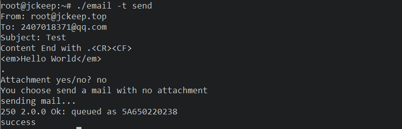

# SMTP/POP3 邮件服务器

用Rust实现的smtp/pop3邮件服务器，用在个人云服务器上对一些状态进行邮件通知及收发

## 协议解析

### SMTP

#### 命令

|命令　　|　　    描述|
|------------|------------------|
|HELO　　  | 　  向服务器标识用户身份发送者能欺骗，说谎，但一般情况下服务器都能检测到。|
|MAIL　　　|　　　初始化邮件传输MAIL　FROM: <email address>|
|RCPT　　　|　　　标识单个的邮件接收人；常在MAIL命令后面可有多个RCPT TO: <email address>|
|DATA　　　|　　　在单个或多个RCPT命令后，表示所有的邮件接收人已标识，并初始化数据传输，以.结束。|
|VRFY　　　|　　　用于验证指定的用户/邮箱是否存在；由于安全方面的原因，服务器常禁止此命令|
|EXPN　　　|　　　验证给定的邮箱列表是否存在，扩充邮箱列表，也常被禁用|
|HELP　　  |　　　查询服务器支持什么命令|
|NOOP　　　| 　 　无操作，服务器应响应OK|
|QUIT　　　|　　　结束会话|
|RSET　　　|　　　重置会话，当前传输被取消|


#### 响应码

|应答码|说明|
|-|-|
|501   |    参数格式错误|
|502   |    命令不可实现|
|503   |    错误的命令序列|
|504   |    命令参数不可实现|
|211   |    系统状态或系统帮助响应|
|214   |    帮助信息|
|220   |    服务就绪|
|221   |    服务关闭|
|421   |    服务未就绪，关闭传输信道|
|250   |    要求的邮件操作完成|
|251   |    用户非本地，将转发向＜forward-path＞|
|450   |    要求的邮件操作未完成，邮箱不可用|
|550   |    要求的邮件操作未完成，邮箱不可用|
|451   |    放弃要求的操作；处理过程中出错|
|551   |    用户非本地，请尝试＜forward-path＞|
|452   |    系统存储不足，要求的操作未执行|
|552   |    过量的存储分配，要求的操作未执行|
|553   |    邮箱名不可用，要求的操作未执行|
|354   |    开始邮件输入，以"."结束|
|554   |    操作失败|


#### *Examples*

* `telnet smtp.qq.com 25`

```
root@DESKTOP-QVUCHRV:~# telnet smtp.qq.com 25
Trying 157.148.54.34...
Connected to smtp.qq.com.
Escape character is '^]'.
220 newxmesmtplogicsvrszc13.qq.com XMail Esmtp QQ Mail Server.
HELO localhost
250-newxmesmtplogicsvrszc13.qq.com-9.46.14.43-29816486
250-SIZE 73400320
250 OK
auth login
334 VXNlcm5hbWU6
MjQwNzAxODM3MUBxcS5jb20=
334 UGFzc3dvcmQ6
Zmhid3lzb2dhcGh5ZGlnYQ==
235 Authentication successful
MAIL FROM: <2407018371@qq.com>
250 OK
RCPT TO: <monster_t@foxmail.com>
250 OK
DATA
354 End data with <CR><LF>.<CR><LF>.
<p><em>hello world!</em></p>

.
250 OK: queued as.
QUIT
221 Bye.
Connection closed by foreign host.
```

### POP3

#### 命令

|命令|描述|
|-|-|
|USER [username]|处理用户名|
|PASS [password]|处理用户密码|
|STAT|处理请求服务器发回关于邮箱的统计资料，如邮件总数和总字节数|
|LIST|处理返回邮件数量和每个邮件的大小|
|RETR|处理返回由参数标识的邮件的全部文本|
|DELE|处理服务器将由参数标识的邮件标记为删除，由quit命令执行|
|RSET|处理服务器将重置所有标记为删除的邮件，用于撤消DELE命令|
|NOOP|处理服务器返回一个肯定的响应|
|QUIT|终止会话|

#### *Examples*

* `telnet pop.qq.com 110`

```
root@DESKTOP-QVUCHRV:~# telnet pop.qq.com 110
Trying 14.18.175.202...
Connected to pop.qq.com.
Escape character is '^]'.
+OK XMail POP3 Server v1.0 Service Ready(XMail v1.0)
user 2407018371
+OK
pass fhbwysogaphydiga
+OK
quit
+OK Bye
Connection closed by foreign host.
```

### MIME

支持多种编码协议及类型

```rust
#[derive(Debug, Clone, Copy)]
pub enum ContentTransferEncoding {
    Base64,
    Bit7,
    QuotedPrintable,
}

#[derive(Debug, Clone, Copy)]
pub enum ContentType {
    TextHtml,
    TextPlain,
    MultipartMixed,
    MultipartAlternative,
    ImageJpeg,
    ImageGif,
    ImagePng,
    ApplicationPdf,
    ApplicationZip,
    ApplicationRar,
    VideoMp4,
    ApplicationPPTX,
    ApplicationWORD,
    ApplicationEXCEL,
    ApplicationOctetStream,
}
```

## 邮件服务器演示

* 本地用户之间发送邮件


* 向qq邮箱发送邮件




* 发送附件


